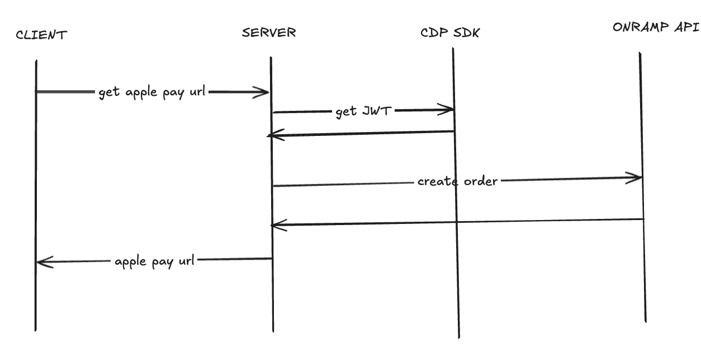

# Welcome to Coinbase Onramp v2 Apple Pay Demo 👋

<div align="center">


**Powered by Coinbase Developer Platform**

A beautiful, modern React Native application for purchasing cryptocurrency using Apple Pay, powered by Coinbase's Onramp v2 API. Features a sleek gradient UI, smooth animations, and seamless Apple Pay integration.

[](https://opensource.org/licenses/MIT)
[](https://reactnative.dev/)
[](https://docs.cdp.coinbase.com/)
[](https://developer.apple.com/apple-pay/)

</div>

---

> **📋 Built for Coinbase Team Initiative**: This app directly addresses [Vijith Bheemireddi's request](https://coinbase-internal-link) to rework the sample app with **easily exportable components** and **flows emulating the Moonshot experience**. Perfect foundation for the team's component library and developer documentation efforts.



## ✨ Features

- 🎨 **Modern UI/UX** - Beautiful gradient background with glassmorphism cards
- 🍎 **Apple Pay Integration** - Native Apple Pay experience using Coinbase Onramp v2 API
- 📱 **React Native** - Cross-platform mobile app (iOS focused for Apple Pay)
- ⚡ **Real-time Updates** - Live ETH conversion estimates
- 🔒 **Sandbox Mode** - Safe testing environment with no real charges
- 🎯 **Optimized Performance** - Fast API calls and smooth animations
- 🎛️ **Smart Input** - Debounced input with keyboard management
- 📊 **Status Tracking** - Real-time payment status with visual feedback

## 🎯 Coinbase Team Initiative - Exportable Components & Moonshot Emulation

This application serves as the **reference implementation** for Coinbase's onramp integration rework, providing:

### 📦 **Easily Exportable Components**

- **`OnrampApplePayButton`** - Drop-in Apple Pay component for any React Native app
- **`CustomInput`** - Modern input component with glassmorphism styling
- **`ApiClient`** - Configurable Coinbase API integration utility
- **Modern UI Kit** - Gradient backgrounds, glassmorphism cards, premium animations

### 🌙 **Moonshot Experience Emulation**

- **Identical User Flow** - Amount input → Apple Pay → Success confirmation
- **Premium Design Language** - Glassmorphism, gradients, smooth animations
- **Native Apple Pay Integration** - Same underlying technology as Moonshot
- **Real-time Feedback** - Live conversion rates and status updates
- **Seamless UX** - No visible WebView artifacts, clean transitions

### 🔧 **Developer-Ready Architecture**

- **Modular Design** - Components easily extracted and integrated
- **Clear Documentation** - Step-by-step integration guide
- **Production Examples** - Working sandbox implementation
- **Best Practices** - Modern React Native patterns and performance optimizations

## 📖 About This Project

This repository serves as the **official reference implementation** for integrating Coinbase's Onramp v2 API with Apple Pay in React Native applications. Developed as part of Coinbase's initiative to provide developers with production-ready, easily exportable components.

### Key Benefits

- ⚡ **Rapid Integration** - Get Apple Pay working in minutes, not hours
- 🛡️ **Security First** - Built following Coinbase security guidelines
- 📱 **Mobile Optimized** - Designed specifically for mobile-first experiences
- 🎨 **Design System** - Includes modern UI components and patterns
- 🔧 **Developer Experience** - Comprehensive documentation and examples

### Perfect For

- **Crypto Wallets** seeking to add fiat onramp functionality
- **DeFi Applications** needing seamless fiat-to-crypto conversion
- **Mobile Apps** wanting to integrate Apple Pay crypto purchases
- **Developer Teams** looking for production-ready onramp components

## 🏗️ Architecture

This is a monorepo containing:

- **`/backend`** - Node.js/Express API server with Coinbase CDP SDK
- **`/mobile`** - React Native app with Expo
- **`/assets`** - Documentation and flow diagrams

## 🚀 Getting Started

### Prerequisites

Before you begin, ensure you have the following installed:

- **Node.js** 18+ ([Download](https://nodejs.org/))
- **npm** or **yarn** package manager
- **Expo CLI** for React Native development
- **iOS device/simulator** (required for Apple Pay testing)
- **Coinbase Developer Platform** account ([Sign up](https://portal.cdp.coinbase.com/))

### System Requirements

| Platform         | Minimum Version |
| ---------------- | --------------- |
| **iOS**          | 13.0+           |
| **Node.js**      | 18.0+           |
| **React Native** | 0.72+           |
| **Expo SDK**     | 49+             |

### 1. Clone the Repository

```bash
git clone https://github.com/echirinos/onramp-v2-apple-pay.git
cd onramp-v2-apple-pay
```

### 2. Install Dependencies

```bash
# Install root dependencies
npm install

# Install backend dependencies
cd backend
npm install

# Install mobile dependencies
cd ../mobile
npm install
```

### 3. Environment Setup

Create a `.env` file in the `/backend` directory:

```bash
cd ../backend
cp .env.example .env
```

Add your Coinbase Developer Platform credentials:

```env
CDP_API_KEY_ID=your_api_key_id_here
CDP_API_KEY_SECRET=your_api_key_secret_here
PORT=3000
```

### 4. Start the Backend Server

```bash
cd backend
npm run dev
```

The server will start on `http://localhost:3000`

### 5. Update Mobile Configuration

In `/mobile/src/utils/apiClient.ts`, update the base URL to your machine's IP:

```typescript
const BASE_URL = "http://YOUR_LOCAL_IP:3000"; // Replace with your IP
```

### 6. Start the Mobile App

```bash
cd mobile
npm start
```

Scan the QR code with Expo Go or run on iOS simulator.

## 🎯 Usage

1. **Enter Amount** - Type the USD amount you want to spend
2. **View Conversion** - See estimated ETH amount in real-time
3. **Tap Apple Pay** - Press the "Buy with 🍎 Pay" button
4. **Complete Payment** - Authorize with Face ID/Touch ID
5. **Success!** - Receive confirmation and transaction details

## 🧪 Testing

The app runs in **sandbox mode** by default:

- ✅ All Apple Pay flows work normally
- ✅ No real money is charged
- ✅ Perfect for testing and demos
- ✅ Uses test transaction data

To enable production mode, update `partnerUserRef` in the mobile app to remove the "sandbox-" prefix.

## 📱 API Endpoints

### Backend Server

- `GET /` - API information and available endpoints
- `GET /health` - Health check
- `POST /api/create-order` - Create Coinbase onramp order

### Mobile App Features

- Real-time amount conversion
- Apple Pay WebView integration
- Payment status tracking
- Error handling and user feedback

## 🛠️ Development

### Backend Development

```bash
cd backend
npm run dev  # Start with hot reload
npm run build  # Build for production
npm start  # Start production build
```

### Mobile Development

```bash
cd mobile
npm start  # Start Expo development server
npm run ios  # Run on iOS simulator
npm run android  # Run on Android (limited Apple Pay support)
```

## 🎨 UI/UX Features

- **Gradient Background** - Beautiful purple-to-pink gradient
- **Glassmorphism Cards** - Semi-transparent cards with backdrop blur
- **Smooth Animations** - Loading states and transitions
- **Responsive Design** - Works on different screen sizes
- **Keyboard Management** - Smart keyboard dismissal
- **Visual Feedback** - Status indicators and progress animations

## 🔧 Technologies Used

### Backend

- Node.js + Express
- Coinbase CDP SDK
- TypeScript
- CORS enabled

### Mobile

- React Native + Expo
- React Native WebView
- Expo Linear Gradient
- TypeScript
- Safe Area Context

## 📝 Configuration

### Coinbase Developer Platform Setup

1. Create account at [Coinbase Developer Platform](https://portal.cdp.coinbase.com/)
2. Generate API credentials
3. Add credentials to backend `.env` file
4. Enable Onramp v2 API access

### Apple Pay Requirements

- iOS device or simulator
- Valid Apple ID
- Payment method added to Wallet app
- Touch ID or Face ID enabled

## 📦 Component Extraction Guide

### Quick Integration - OnrampApplePayButton

To use the Apple Pay component in your own app:

```tsx
import OnrampApplePayButton from "./path/to/OnrampApplePayButton";

// In your component
<OnrampApplePayButton fiatAmount={amount} />;
```

### Required Dependencies

```bash
npm install react-native-webview expo-linear-gradient
```

### Backend Integration

```typescript
// Use the provided API client or extract the Coinbase integration
import { apiClient } from "./utils/apiClient";

const order = await apiClient.post("/api/create-order", orderData);
```

### Styling Components

All UI components use exportable style objects that can be customized:

- Glassmorphism card styles
- Gradient backgrounds
- Modern input components
- Loading state animations

## 🤝 Contributing

1. Fork the repository
2. Create a feature branch
3. Make your changes
4. Test thoroughly
5. Submit a pull request

## 📄 License

This project is licensed under the MIT License - see the [LICENSE](LICENSE) file for details.

## 🔒 Security

This application follows Coinbase security best practices:

- **API Keys**: Never expose CDP API keys in client-side code
- **Sandbox Mode**: All transactions use sandbox environment by default
- **HTTPS Only**: All API communications use secure HTTPS
- **Input Validation**: Proper validation on all user inputs
- **Error Handling**: Secure error handling without exposing sensitive data

For security issues, please follow our [Security Policy](SECURITY.md).

## 🙏 Acknowledgments

- [Coinbase Developer Platform](https://docs.cdp.coinbase.com/) for the Onramp v2 API
- [Expo](https://expo.dev/) for the development platform
- [React Native](https://reactnative.dev/) for the mobile framework

## 📞 Support & Resources

<div align="center">

### 🔗 Official Links

[](https://docs.cdp.coinbase.com/)
[](https://docs.cdp.coinbase.com/onramp/docs/api-configurations)
[](https://discord.gg/coinbasecloud)

**Questions?** Open an issue on GitHub or check the [Coinbase Developer documentation](https://docs.cdp.coinbase.com/)

</div>

---

<div align="center">


**Built with ❤️ using Coinbase Onramp v2 API**

_Empowering the next generation of crypto applications_

[](https://www.coinbase.com/)

</div>
